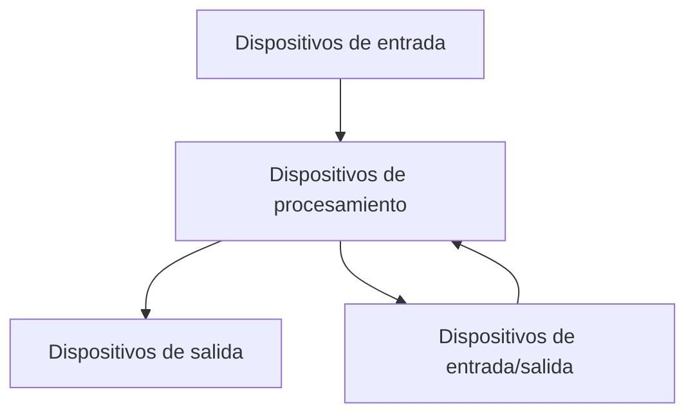
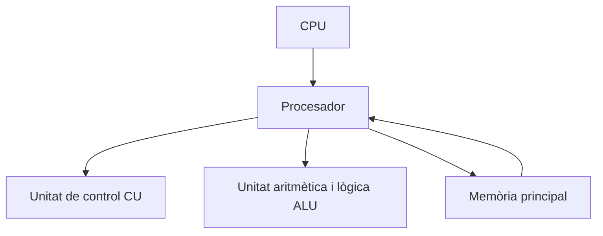
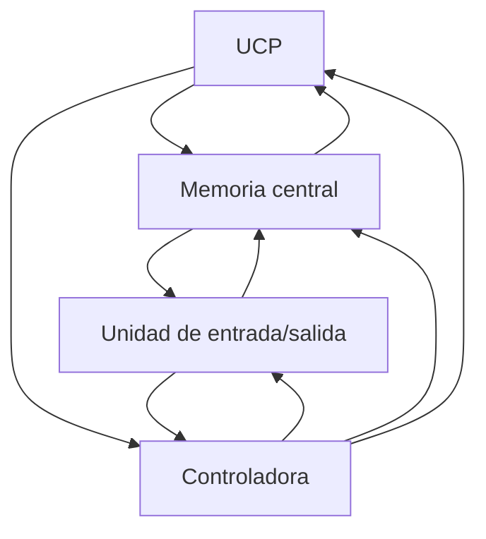
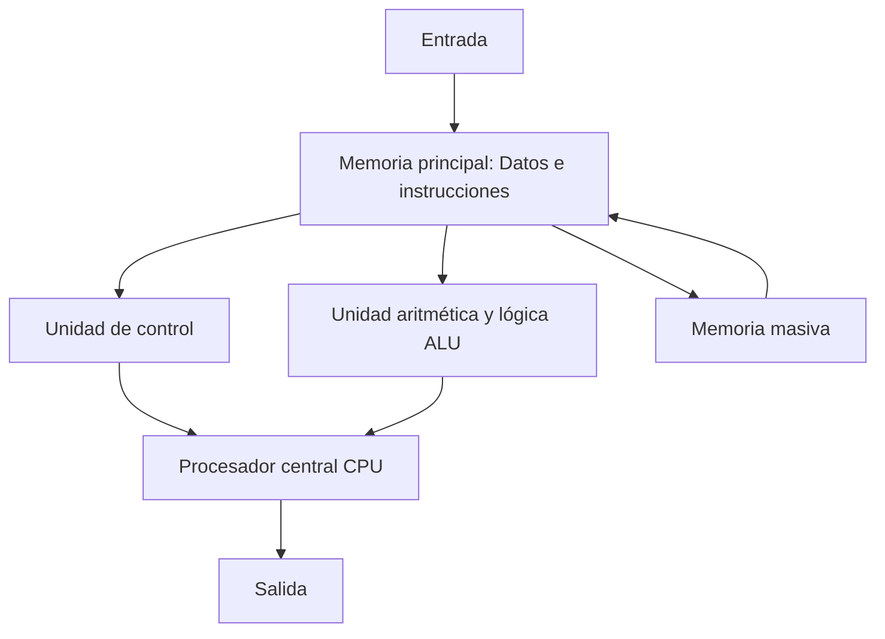
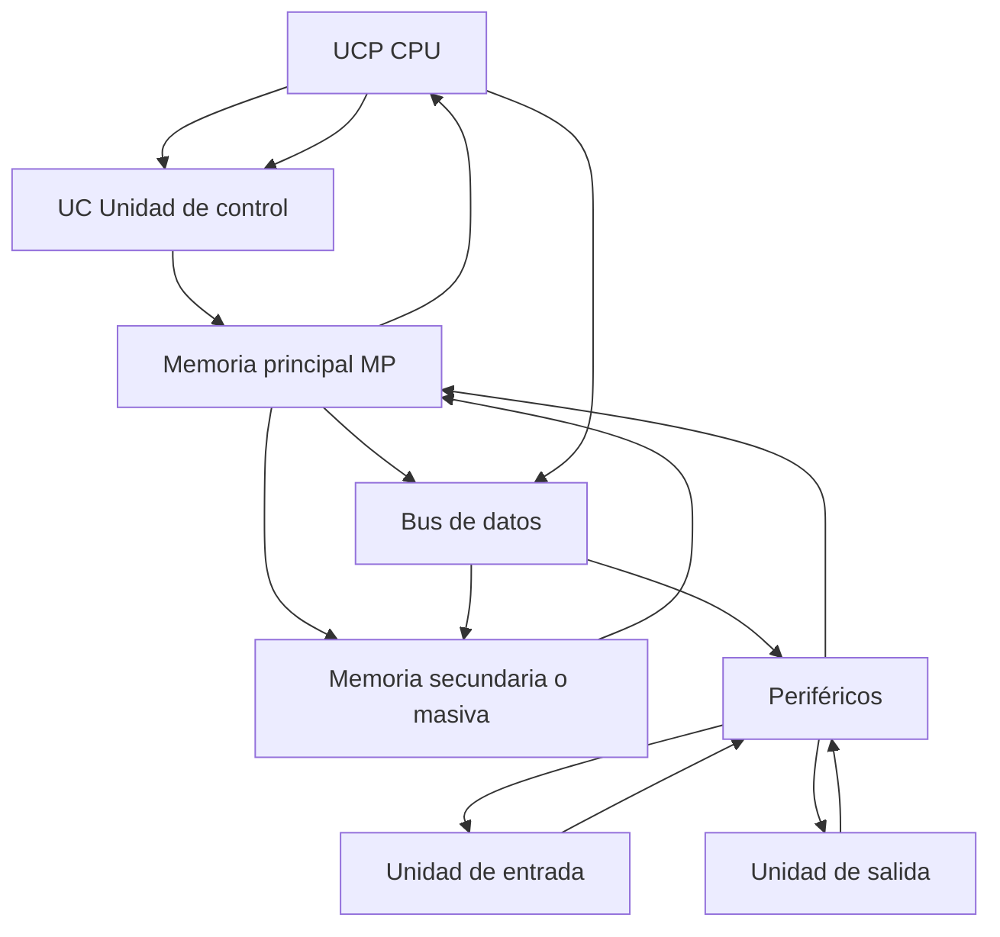
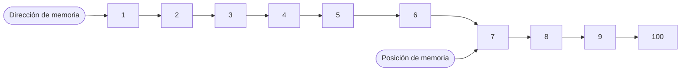

# Esquema funcional y estructura de un ordenador

## Sistema informático

Un sistema informático es un conjunto de elementos necesarios para la realización y explotación de aplicaciones informáticas, se incluyen 3 tipos, programas, maquinaria y humanos.

En un sistema informático hay elementos constitutivos interelacionados entre si:

- Parte lógica: Hardware, todo aquello que se puede ver y tocar en el mundo de la informática (monitores, impresoras, ratón, teclado, etc.)

- Parte lógica: Software, tiene su origen en las ideas (conceptos) y está formado por todo aquello que usamos en el campo de la informática que no se puede ni ver ni tocar (programas, SO, etc.)

- Parte humana: Este elemento es esencial que forma parte de la informática o de un sistema informático. Sin las personas que están a cargo de la informática no habría ni parte lógica ni física.

## Funcionalidad
Su función principal es el procesamiento de datos.

## Características
+ Hace una acción a la vez.
+ Puede hacer cálculos matemáticos: suma, resta, multiplicación, división, etc.
+ Puede realizar operaciones lógicas: AND, OR, NOT, XOR, etc.
+ Opera a alta velocidad.
+ Es exacto y preciso, hace exactamente lo que se le indica.
+ Es eficiente, puede trabajar sin parar.
+ Tiene capacidad de manipular grandes cantidades de información.
+ Es fiable, tiene la capacidad de verificar la exactitud de sus operaciones internas, es decir, autocomprobación.
+ Puede manipular símbolos
+ Cada vez son mas pequeños y mas utiles y menos costosos.

## Definiciones

+ Maquinaria (Hardware): Todo aquello que podemos ver y tocar (Monitores, impresoras, ratón, teclado, etc.)

+ Programas (Software): Hace referencia a los elementos que no tienen existencia física, como las ideas, conceptos, programas y las aplicaciones.

+ Usuario y programador: El usuario es el que utiliza el sistema informático, es decir, el que interactúa con él. El programador es el que escribe los programas que se utilizan en el sistema informático. Escrito en un lenguaje de programación para que los ordenadores puedan entenderlo.

+ Datos y información: Los datos son hechos o materiales originales que no han sido modificados. La información es el producto de los datos ya procesados.

+ Documentación: Es el conjunto de instrucciones o manuales de procedimiento que enseñan al usuario como se tiene que utilizar el ordenador y los programas informáticos.

## Elementos principales

+ Dispositivos de entrada: Su función principal consiste en permitir la entrada de datos en el ordenador.

+ Dispositivos de salida: Su función principal consiste en sacar la información al exterior del ordenador.

+ Dispositivos de entrada/salida: Son todas las maquinas de configuración de las cuales permiten hacer funciones de entrada y salida (Cintas mágneticas, unidades de discos mágneticos o unidades opticomágneticas, etc.)

### Dispositivos de procesamiento
También conocidos como UCP (Unidad central de procesamiento) o CPU. Es la parte más importante de un ordenador, en el que se manipula la información. Los dispositivos de procesamiento son los que se encargan de coordinar y llevar a cabo todas las operaciones de tipo lógico y matemático.

+ Procesador (microprocesador): Cerebro del ordenador, coordina y dirige la faena que se tiene que hacer en cada momento.
+ CU (Unidad de cntrol): Se encarga de governar el resto de las unidades, es decir, interpreta las instrucciones y controla la ejecución y la secuencia.

+ ALU (Unidad Aritmético-Lógica): Realiza operaciones matemáticas y lógicas.

## Unidades funcionales

+ Unidades de entrada
+ Unidades de procesamiento y almacenamiento
+ Unidades de salida
+ Unidades entrada/salida

Definimos como unidades funcionales del ordenador como el conjunto de elementos de maquinaria imprescindibles para que el ordenador funcione.

Se pueden clasificar en 3 tipos:

+ CPU
+ Memoria principal
+ I/O

Todos los elementos que forman las unidades funcionales necesitan algún tipo de comunicación para funcionar correctamente, a esto se le llama bus y se consigue con el bus del sistema.

También para la comunicación entre estos dispositivos y otras máquinas sea eficiente, a veces hace falta que otras máquinas las gestionen. Esto es lo que hacen los controladores. Son dispositivo que gestionan el funcionamiento de determinadas máquinas y hacen la comunicación entre elementos de las unidades funcionales y dispositivos periféricos.

**UCP, Memoria central, controladora, I/O**

**Entrada, procesador, memoria, UC, ALU**

**UCP, Unidad de control, memoria, periféricos, buses de datos y control**

## Memoria principal y sus elementos

La memoria principal o central, es el dispositivo electronico en el cual se situan los datos o instryucciones que manipulará la ALU o los resultados que se obtengan de estos tratamientos.

La memoria principal tiene una capacidad límitada y en determinados momentos el precio de las memorias principales han estado mas elevados que otros componentes de maquinaria. Por esto y otros factores, esta memoria complementa con la memoria externa o memoria secundaria.

### Elementos de la memoria principal

La memoria principal está formada por celdas o posiciones de memoria numeradas de manera consecutiva. Dichas celdas son capaces de mantener la información almacenada en ellas mientras esté el ordenador en funcionamiento.

Cada celda tiene un nombre que se denomina como posición de memoria y un identificador único que se denomina dirección de memoria.

