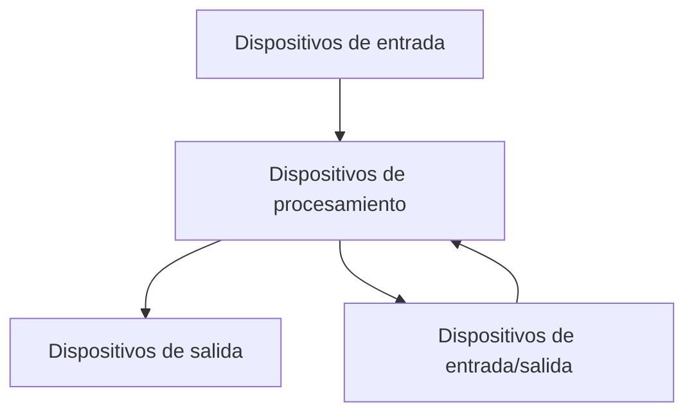
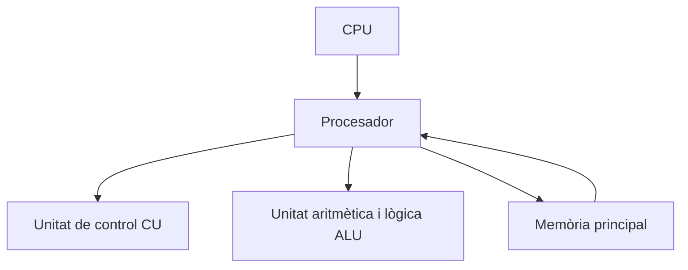
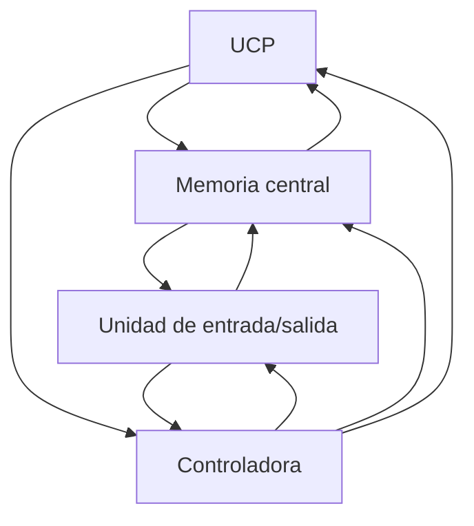
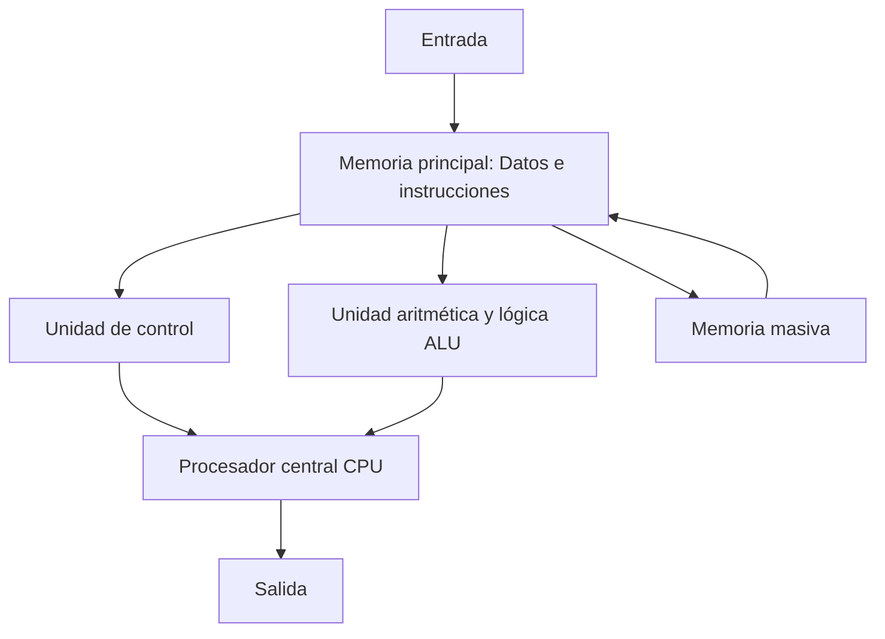
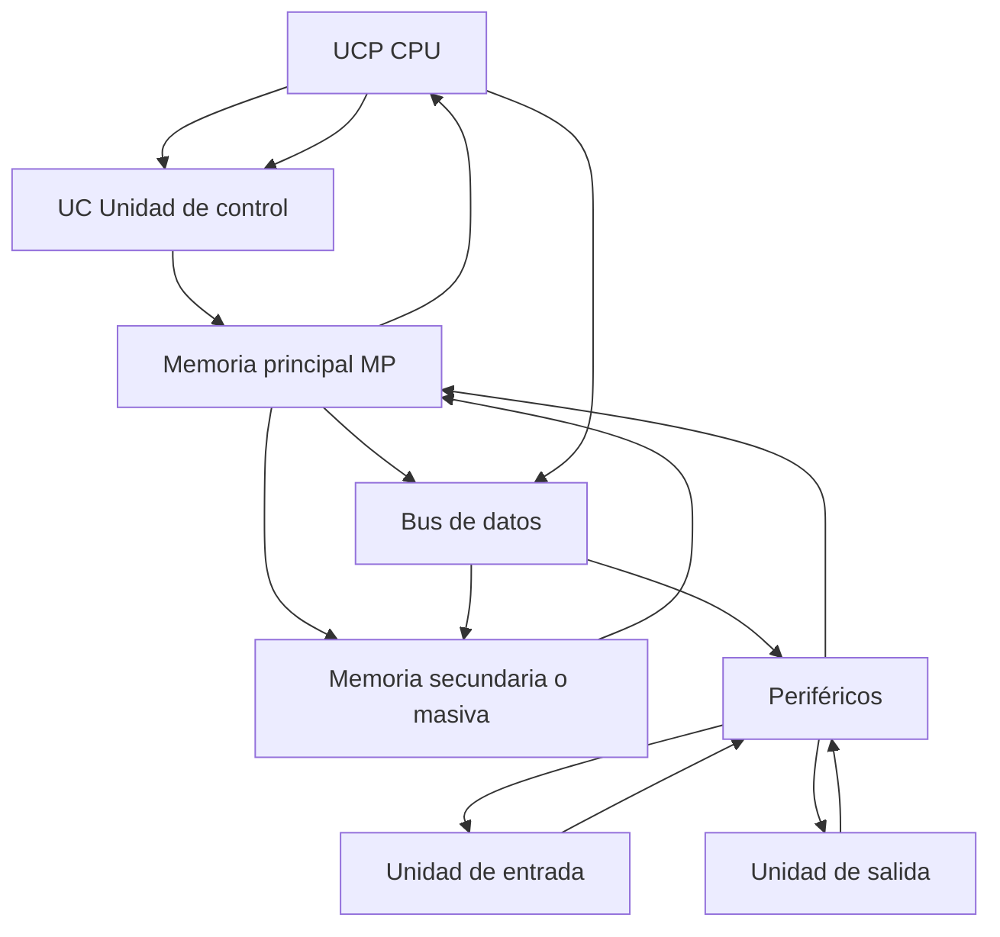
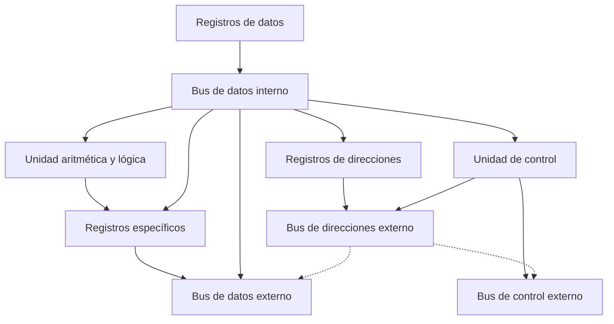
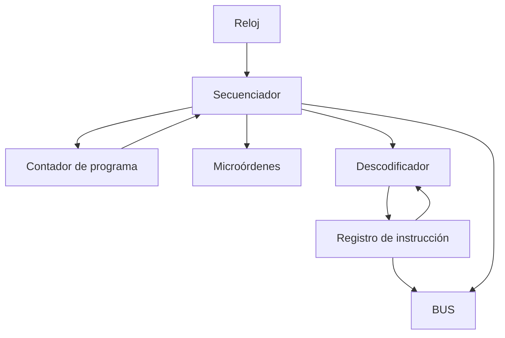
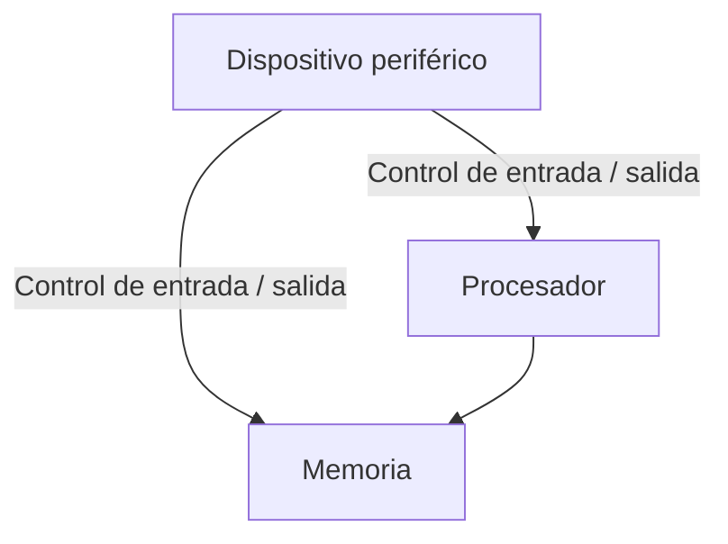
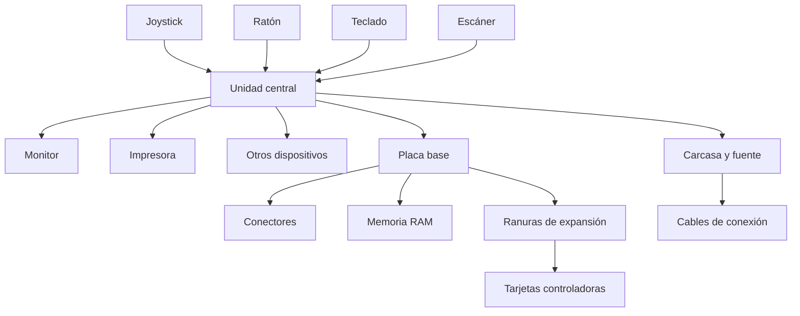

# Esquema funcional y estructura de un ordenador

## Sistema informático

Un sistema informático es un conjunto de elementos necesarios para la realización y explotación de aplicaciones informáticas, se incluyen 3 tipos, programas, maquinaria y humanos.

En un sistema informático hay elementos constitutivos interelacionados entre si:

- Parte física: Hardware, todo aquello que se puede ver y tocar en el mundo de la informática (monitores, impresoras, ratón, teclado, etc.)

- Parte lógica: Software, tiene su origen en las ideas (conceptos) y está formado por todo aquello que usamos en el campo de la informática que no se puede ni ver ni tocar (programas, SO, etc.)

- Parte humana: Este elemento es esencial que forma parte de la informática o de un sistema informático. Sin las personas que están a cargo de la informática no habría ni parte lógica ni física.

## Funcionalidad
Su función principal es el procesamiento de datos.

## Características
+ Hace una acción a la vez.
+ Puede hacer cálculos matemáticos: suma, resta, multiplicación, división, etc.
+ Puede realizar operaciones lógicas: AND, OR, NOT, XOR, etc.
+ Opera a alta velocidad.
+ Es exacto y preciso, hace exactamente lo que se le indica.
+ Es eficiente, puede trabajar sin parar.
+ Tiene capacidad de manipular grandes cantidades de información.
+ Es fiable, tiene la capacidad de verificar la exactitud de sus operaciones internas, es decir, autocomprobación.
+ Puede manipular símbolos
+ Cada vez son mas pequeños y mas utiles y menos costosos.

## Definiciones

+ Maquinaria (Hardware): Todo aquello que podemos ver y tocar (Monitores, impresoras, ratón, teclado, etc.)

+ Programas (Software): Hace referencia a los elementos que no tienen existencia física, como las ideas, conceptos, programas y las aplicaciones.

+ Usuario y programador: El usuario es el que utiliza el sistema informático, es decir, el que interactúa con él. El programador es el que escribe los programas que se utilizan en el sistema informático. Escrito en un lenguaje de programación para que los ordenadores puedan entenderlo.

+ Datos y información: Los datos son hechos o materiales originales que no han sido modificados. La información es el producto de los datos ya procesados.

+ Documentación: Es el conjunto de instrucciones o manuales de procedimiento que enseñan al usuario como se tiene que utilizar el ordenador y los programas informáticos.

## Elementos principales

+ Dispositivos de entrada: Su función principal consiste en permitir la entrada de datos en el ordenador.

+ Dispositivos de salida: Su función principal consiste en sacar la información al exterior del ordenador.

+ Dispositivos de entrada/salida: Son todas las maquinas de configuración de las cuales permiten hacer funciones de entrada y salida (Cintas mágneticas, unidades de discos mágneticos o unidades opticomágneticas, etc.)

### Dispositivos de procesamiento
También conocidos como UCP (Unidad central de procesamiento) o CPU. Es la parte más importante de un ordenador, en el que se manipula la información. Los dispositivos de procesamiento son los que se encargan de coordinar y llevar a cabo todas las operaciones de tipo lógico y matemático.

+ Procesador (microprocesador): Cerebro del ordenador, coordina y dirige la faena que se tiene que hacer en cada momento.
+ CU (Unidad de cntrol): Se encarga de governar el resto de las unidades, es decir, interpreta las instrucciones y controla la ejecución y la secuencia.

+ ALU (Unidad Aritmético-Lógica): Realiza operaciones matemáticas y lógicas.

## Unidades funcionales

+ Unidades de entrada
+ Unidades de procesamiento y almacenamiento
+ Unidades de salida
+ Unidades entrada/salida

Definimos como unidades funcionales del ordenador como el conjunto de elementos de maquinaria imprescindibles para que el ordenador funcione.

Se pueden clasificar en 3 tipos:

+ CPU
+ Memoria principal
+ I/O

Todos los elementos que forman las unidades funcionales necesitan algún tipo de comunicación para funcionar correctamente, a esto se le llama bus y se consigue con el bus del sistema.

También para la comunicación entre estos dispositivos y otras máquinas sea eficiente, a veces hace falta que otras máquinas las gestionen. Esto es lo que hacen los controladores. Son dispositivo que gestionan el funcionamiento de determinadas máquinas y hacen la comunicación entre elementos de las unidades funcionales y dispositivos periféricos.

**UCP, Memoria central, controladora, I/O**

**Entrada, procesador, memoria, UC, ALU**

**UCP, Unidad de control, memoria, periféricos, buses de datos y control**

## Memoria principal y sus elementos

La memoria principal o central, es el dispositivo electronico en el cual se situan los datos o instryucciones que manipulará la ALU o los resultados que se obtengan de estos tratamientos.

La memoria principal tiene una capacidad límitada y en determinados momentos el precio de las memorias principales han estado mas elevados que otros componentes de maquinaria. Por esto y otros factores, esta memoria complementa con la memoria externa o memoria secundaria.

### Elementos de la memoria principal

La memoria principal está formada por celdas o posiciones de memoria numeradas de manera consecutiva. Dichas celdas son capaces de mantener la información almacenada en ellas mientras esté el ordenador en funcionamiento.

Cada celda tiene un nombre que se denomina como posición de memoria y un identificador único que se denomina dirección de memoria.

+ Registro de dirección de memoria: Antes de realizar cualquier operación de lectura o escritura en la memoria, se tienen que colocar la dirección de la celda que se utilizará en la operación de este registro, tanto como si es para grabar la dirección en un registro o como si es para extraer datos.

+ Registro de información o intercambio de memoria (RIM): Este registro recibe la información obtenida de la lectura de la memoria. Este registro tiene que contener la información que queremos escribir y guardar en la memoria.

+ Selector de memoria o descodificador: Este dispositivo se activa cada vez que se produce una orden de lectura o escritura. Conecta la celda de memoria, indicada por la dirección de registro de la dirección de memoria con el registro de información de memoria. El cual lo hace posible el hacer transferencias de datos en un sentido o en otro (memoria a RIM, RIM a memoria).

Hay 3 parámetros para medir la velocidad de respuesta de una memoria:

+ TA (Tiempo de acceso): Es el tiempo máximo que se tarda en leer o escribir el contenido de una posición de memoria.

+ Tiempo de ciclo (TC): El tiempo mínimo entre 2 lecturas.

+ Ancho de banda (AB): Es el número de palabras que se transfieren entre la memoria y la CPU en cada unidad de tiempo.

$$
AB = 1 / TC
$$

**Secuencia de pasos para leer o escribir un dato en la memoria principal**

1. Leer: Para leer un dato se siguen los pasos siguientes:
+ Se pone la dirección de memoria en el registro de dirección.
+ Mediante el descodificador, se accede a la dirección de memoria.
+ Se situan los datos en el registro de datos.

2. Escribir: Para escribir un dato se siguen los pasos siguientes:
+ Se transfiere la dirección en la qeu se escribirá en el registro de dirección.
+ Se transfieren los datos al registro de información.
+ Se descodifica la dirección de memoria.
+ Se pasa el contenido del registro de información a la dirección que contiene el registro de dirección.

## CPU

Como hemos mencionado anteriormente, el CPU es el cerebro del ordenador, es el encargado de coordinar y dirigir la ejecución de todas las operaciones de procesamiento.

Está formada por:
+ Registros
+ ALU
+ CU

### Los registros

Dentro del procesador hay unas zonas reservadas para el almacenamiento de pequeñas cantidades de información. Son los registros internos.

Se denomina registro un conjunto de bits que se manipulan en bloque.

Podemos diferenciar 2 tipos de registros internos:

+ Registros internos de uso general: El procesador usa estos registros para el almacenamiento temporal de datos o direcciones de memoria, es decir la posición de memoria que se almacenan los datos. Podemos encontrar los siguientes:

+ Registros internos de datos: Se usan para almacenar datos que el procesador solicita frecuentemente.

+ Registros internos de dirección: Se puede guardar la dirección de memoria donde se encuentra el dato.

Registros internos específicos, podemos indicar los siguientes:
+ Contador de programa: Uno de los registros que lleva a cabo el control de las instrucciones del programa que se ejecutan es el contador de programa. Se trata de un registro específico que está pendiente de la instrucción del programa que se ejecuta o el próximo a ejecutar.

+ Puntero de pila: dentro de la RAM, hay una zona destinada al almacenamiento de información temporal, es decir pila o stack. Es un registro que mantiene la dirección de un dato que está almacenado en la pila.

+ Indicador de resultado: Cada bit del registro indicador de resultado (flag register, FLAGS) contiene información sobre el resultado de la última operación efectuada en la ALU. El numero de bits del FLAGS y su significado varían de un procesador a otro.

+ Registro de instrucción: La unidad de control tiene una referencia permanente de la instrucción en curso mediante el registro de instrucción. Mantiene el código de la instrucción que se está ejecutando.

### ALU
La unidad aritmética y lógica gestiona las operaciones elementales de tipo aritmético (sumas, restos, etc etc.) y, también, las de tipo lógico (operaciones en las que el resultado es verdadero o falso).

Esta unidad tiene dos entradas para los operandos y una salida para el resultado. El procesador se dirige a las entradas ALU cuyos registros debe realizarse la operación. El resultado aparece a la salida de la ALU y se recoge en un registro o se envía al autobús. Muchos procesadores dirigen la salida de la ALU hacia el acumulador.

Podemos encontrar los siguientes:

+ Circuitos operacionales: Circuitos necesarios para hacer las operaciones con los datos procedentes de los registros de entrada.

+ Registro de entrada: Almacena datos o operandos que intervienen en una instrucción antes de la realización de la operación por parte del circuito operacional.

+ Registro acumulador: Almacena los resultados númericos del circuito operacional.También está conectado a los registros de entrada para la retroalimentación, en caso de operaciones encadenadas y tiene una conexión con el bus de datos para enviar los resultados a la memoria principal o a la UC.

+ Registro de estado: Registro que almacena algunas condiciones de situaciones esdevenidas en la ultima operación hecha y que tenemos que tener en cuenta en las operaciones siguientes.

### Buses
+ Bus de datos: Mueve los datos entre los dispositivos del maquinario de entrada, de salida y de almacenamiento.
+ Bus de direcciones: Está vinculado al bloque de control de la CPU para prender y colocr los datos en el subsistema de memoria durante la ejecución de los procesos de computo.

+ Bus de control: Transporta señales de estado de las operaciones hechas por el CPU con el resto de unidades.

### Unidad de control

La unidad de control hace una serie de operaciones básicas para el funcionamiento del procesador:

+ Interpreta las instrucciones del programa que llegan a la memoria del sistema.
+ Dirige los registros adecuados hacia la ALU.
+ Controla los buses internos.
+ Ordena a la ALU efectuar la operación indicada en el programa.
+ LLeva de la memoria los datos necesarios y envia los datos resultantes.
+ Gestiona los buses externos de comunicación con la memoria externa y los periféricos.

+ Decodificador de instrucciones: La instruccion que el procesador lleva de la memoria se almacena en el registro de instrucción. IR.

+ Reloj o temporizador: El ritmo de funcionamiento del descodificador de instrucciones estan sincronizados con el reloj por medio del bloque secuenciador.

+ Secuenciador: Es el dispositivo que marca las pautas con que se tienen que ejecutar las diferentes partes de la instrucción en la coordinación con los impulsos enviados por el reloj.

### Arquitectura de la CPU

Los microprocesadores se han fabricado usando 2 tecnologías conocidas con los nombres de CISC y RISC. Las características de ambas tecnologías son las siguientes:

+ CISC: (complex instruction set computing): La tecnología mas usada en lafabricación de los microprocesadores, que consiste en el uso de un juego de instrucciones complejas que se basan en la implementación de un gran numero de instrucciones en el procesador para hacer posible tenir programas mas pequeños y por tanto mas rápidos. Los CPU y los CISC mas extendidos son de la familia 80x86 de intel.

+ RISC (Reduced instruction set computing): En esta tecnología se usa un juego de instrucciones reducido y se intenta utilizar el numero mas pequeño de instrucciones. Es el mas fácil de diseñar y tiene la ventaja de hacer las operaciones a mas velocidad, a coste de usar programas mas rápidos. Es una tecnologia mas simple. Pero permite minimizar el numero de instrucciones y la complejidad a a la hora de diseñar un CPU.

## Soportes y unidades de I/O
Los soportes se pueden clasificar de diferentes maneras, pero las más usadas son las siguientes:

### Por el uso que se le da:
- **Reutilizable**: Podemos usar el soporte más de una vez para guardar información (por ejemplo, disquetes, disco duro, cinta magnética, etc.).
- **No Reutilizable**: Solo se puede utilizar una vez para guardar la información (por ejemplo, papel, ficha perforada, etc.).

### Por la forma de acceso a la información:
- **Secuenciales**: Para acceder a una determinada información del soporte, es necesario pasar por toda la información anterior (por ejemplo, disco duro, cinta magnética, etc.).
- **Directos**: Permiten acceder a la información de manera directa o inmediata.

### Por las características físicas del soporte:
- **Perforados**: Son los que codifican y mantienen la información mediante perforaciones en el soporte.
- **Magnéticos**: Mantienen la información codificada mediante dispositivos magnéticos.
- **Ópticos**: Los contenidos de estos soportes se manipulan mediante técnicas especiales como la reflexión de la luz.
- **Otros tipos**: Agrupa todos los soportes que no se pueden clasificar en las categorías anteriores y que presentan los resultados de un proceso.

### Por su situación:
- **Locales**: El soporte está situado en el mismo lugar en el que se manipulará.
- **Remotos**: El soporte se encuentra en un lugar diferente al de la manipulación de la información.
- **Periféricos**: Dispositivo periférico es una unidad capaz de manipular el soporte de datos y que permite la comunicación entre el usuario y el ordenador.

### Clasificación de los periféricos:

#### Según la función:
- **Entrada**: Su función es introducir datos desde el exterior a la memoria principal del ordenador.
- **Salida**: Su función es extraer datos de la memoria principal al exterior.
- **I/O**: Son dispositivos capaces de realizar ambas funciones (por ejemplo, discos magnéticos, etc.).

#### Por la situación respecto a la CPU:
- **Locales**: Están situados cerca de la CPU.
- **Remotos**: Están situados lejos de la CPU, por lo que requieren sistemas complementarios para gestionarlos.

## Interfaz procesador-periférico
+ Registros: Los dispositivos se pueden conectar al procesador mediante los registros de los dispositivos, los cuales se pueden acceder de manera directa en una zona determinada de memoria o indirectamente por orden de la maquinaria que devuelve el estado del dispositivo
+ Controladores: Los dispositivos complejos, no se conectan directamente al procesador, si no que por medio de un controlador que contiene el estado del dispositivo, lo controla y comprueba los datos transferidos.
+ Canales: Normalmente los controladores estan conectados al procesador por un canal o procesador de I/O (IOP)

## Estructura externa de un sistema microinformático

La estructura externa de un equipo microinformático consta básicamente de 4 elementos:
1. UC Unidad central
2. Monitor
3. Teclado
4. Ratón

Los elementos externos a la unidad central se conectan por medio de sus cables.

| Conector            | Descripción                                                                                                                                                       |
|---------------------|-------------------------------------------------------------------------------------------------------------------------------------------------------------------|
| **DIN hembra**      | Tiene cinco orificios y corresponde al antiguo conector del teclado estándar. Actualmente no se utiliza.                                                           |
| **PS/2 hembra**     | Es el conector del teclado y ratón de tipo PS/2. También se denomina mini DIN.                                                                                      |
| **DE-9 macho**      | Conector de nueve pines. Es el conector en serie RS-232C, también llamado COM1. Actualmente no se utiliza. Se usaba en los primeros ordenadores para conectar el ratón. |
| **DB-25 macho**     | Conector de 25 pines. Es el conector en serie RS-232C, también conocido como COM2, actualmente en desuso en la mayoría de ordenadores.                             |
| **DB-25 hembra**    | Conector de 25 pines. Es el conector paralelo Centronics o LPT1, usado para impresoras, aunque actualmente se conectan mediante USB.                                |
| **DB-15 HD (alta densidad) hembra** | Salida de video de quince orificios distribuidos en tres filas. Es el conector VGA y SVGA.                                                           |
| **DB-15 hembra**    | Es el conector de juegos.                                                                                                                                          |
| **USB**             | Es el conector de bus en serie universal.                                                                                                                          |
| **RJ11**            | Es el conector de módem para conectar la línea telefónica.                                                                                                         |
| **RJ45**            | Es el conector de red (Ethernet).                                                                                                                                  |
| **DVI**             | Conector para monitores de ordenador que transmite la imagen en formato digital. La configuración estándar tiene 29 pines.                                         |
| **HDMI**            | Interfaz multimedia de alta definición que permite transmitir audio y video digital de alta calidad entre dispositivos como televisores, tabletas, y teléfonos móviles. |
| **e-SATA**          | Interfaz externa para conectar dispositivos SATA.                                                                                                                  |
| **DisplayPort**     | Interfaz de audio/vídeo digital que permite conectar un equipo y su monitor.                                                                                       |
| **Thunderbolt**     | Interfaz que permite conectar equipos de alto rendimiento a velocidades de hasta 10 Gbps, gestionando tráfico de dispositivos que usan PCIe y DisplayPort.           |

